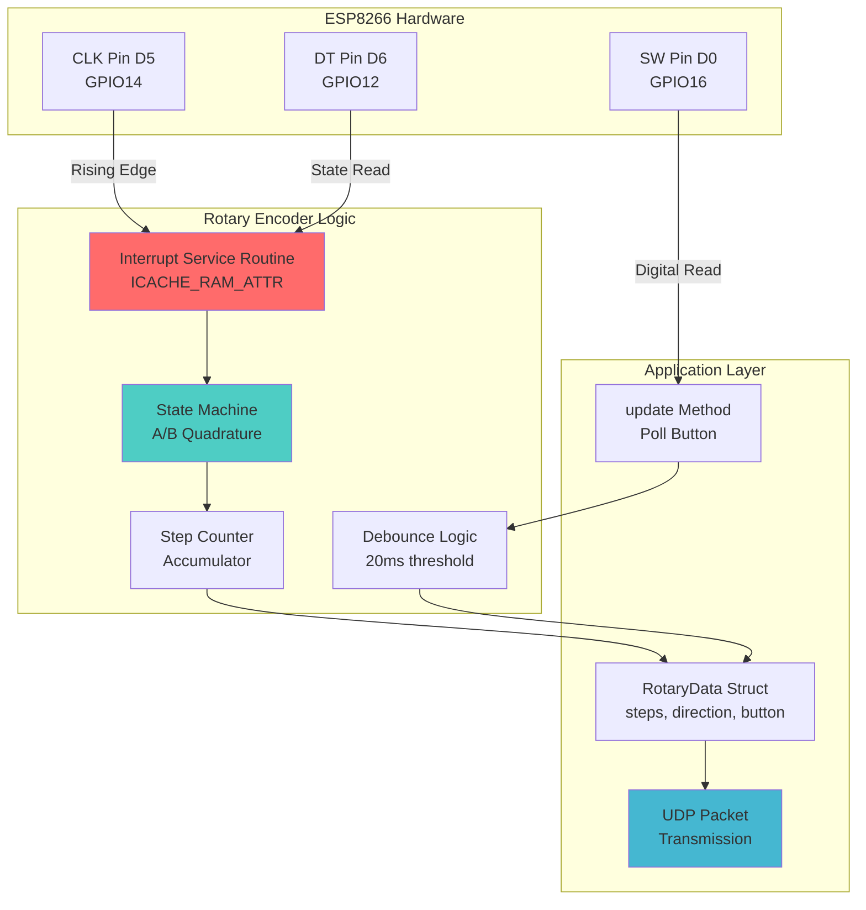
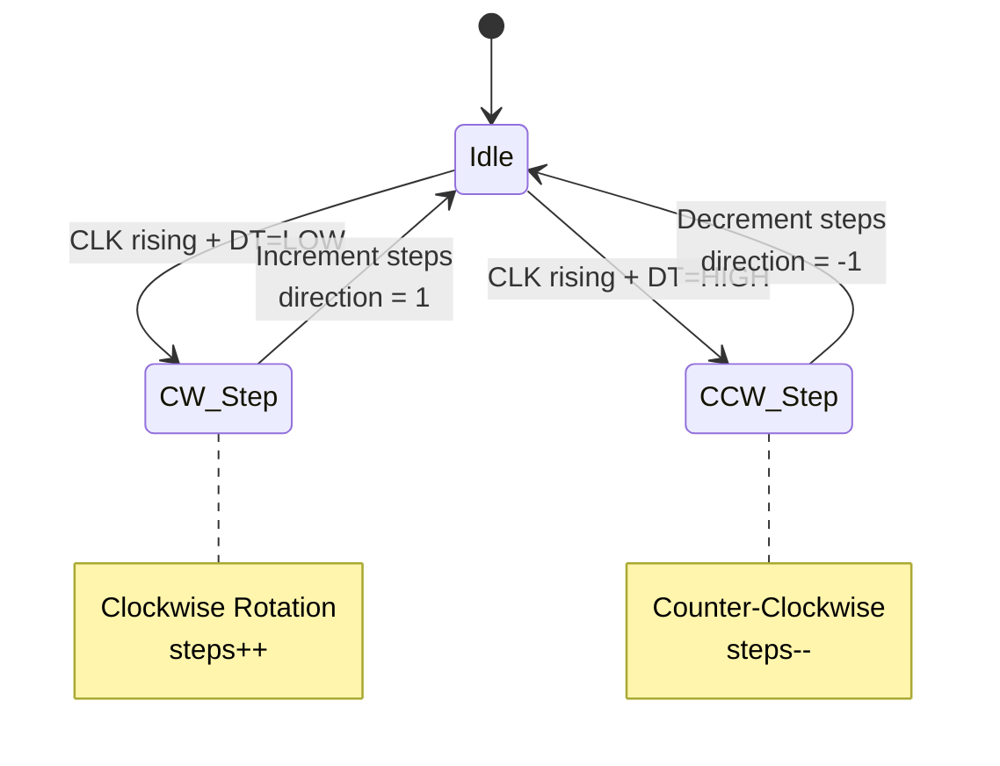
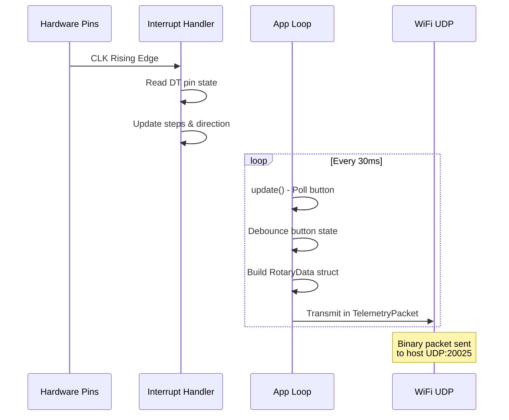
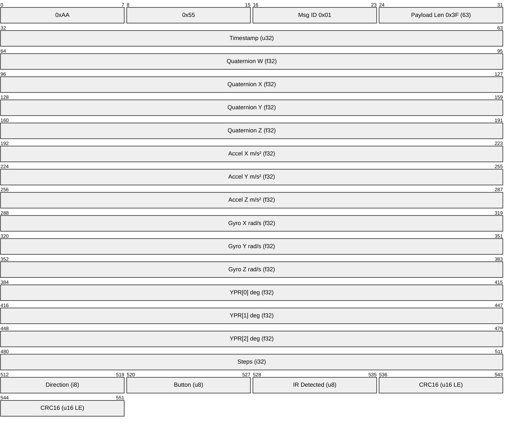
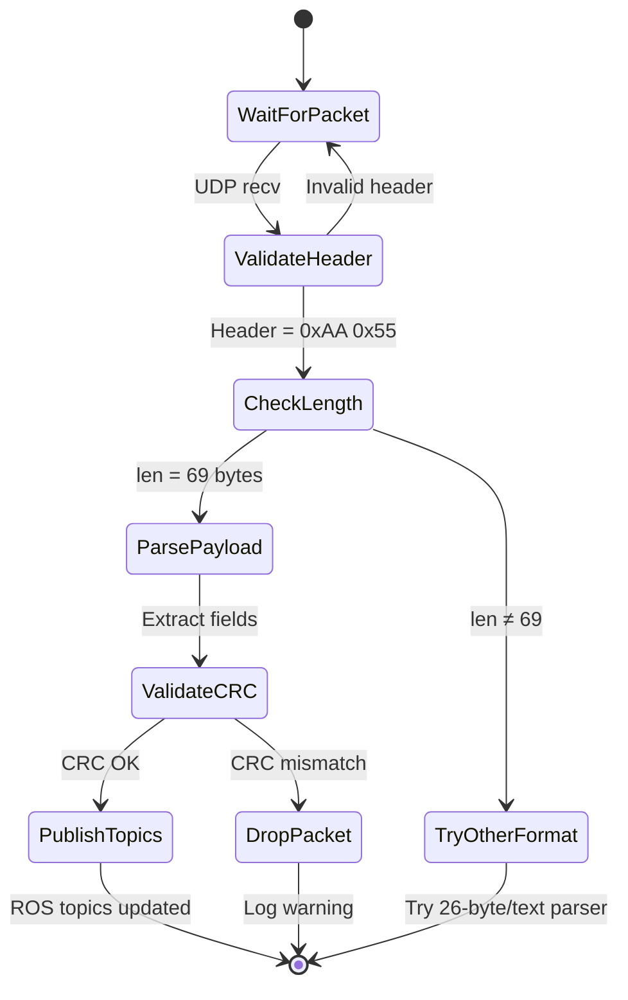
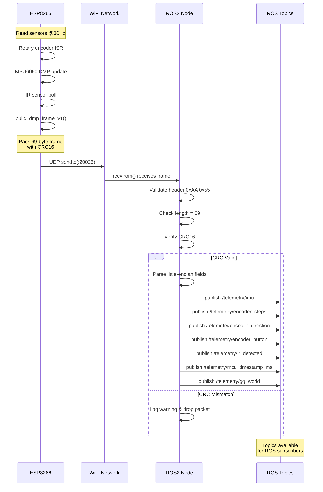
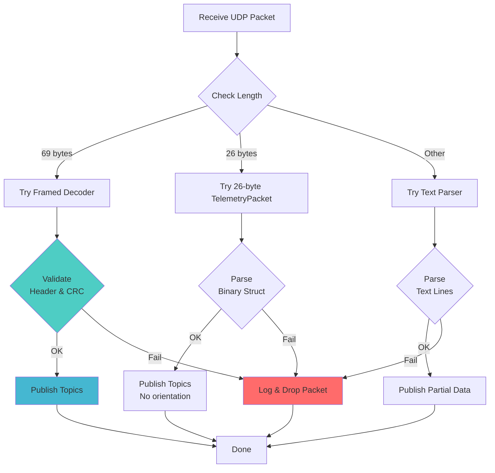

# Robot Telemetry System Presentation

---

## Slide 1: Rotary Encoder Implementation

### System Overview

The rotary encoder system uses interrupt-driven architecture on ESP8266 to track rotation, direction, and button state with minimal CPU overhead.

### Architecture Diagram



### Interrupt-Driven Quadrature Decoding

**Block Diagram: Quadrature State Machine**



### Key Code Implementation

#### Interrupt Service Routine (ISR)
```cpp
// RotaryEncoder.cpp - ISR marked for IRAM execution
ICACHE_RAM_ATTR void RotaryEncoder::handleRotaryInterrupt() {
  int dtValue = digitalRead(dtPin);
  
  // Quadrature decoding: CLK rising edge
  if (dtValue == LOW) {
    steps++;        // Clockwise
    direction = 1;
  } else {
    steps--;        // Counter-clockwise
    direction = -1;
  }
}
```

#### Debounced Button Reading
```cpp
// RotaryEncoder.cpp - Button state with debouncing
void RotaryEncoder::update() {
  int reading = digitalRead(swPin);
  unsigned long currentTime = millis();
  
  // Debounce: ignore changes within 20ms window
  if ((currentTime - lastDebounceTime) > debounceDelay) {
    if (reading != lastButtonState) {
      button = (reading == LOW);  // Active LOW button
      lastDebounceTime = currentTime;
    }
  }
  lastButtonState = reading;
}
```

#### Data Structure
```cpp
// RotaryEncoder.hpp - Published data format
struct RotaryData {
  long steps;        // Accumulated rotation steps
  int direction;     // Current direction: 1 (CW), -1 (CCW), 0 (idle)
  bool button;       // Button state: true (pressed), false (released)
};
```

### Published Data Flow



### Interrupt Configuration

```cpp
// RotaryEncoder.cpp - Setup interrupt attachment
void RotaryEncoder::begin() {
  pinMode(clkPin, INPUT_PULLUP);
  pinMode(dtPin, INPUT_PULLUP);
  pinMode(swPin, INPUT_PULLUP);
  
  // Attach ISR to CLK pin (rising edge trigger)
  attachInterrupt(digitalPinToInterrupt(clkPin), 
                  handleRotaryInterruptStatic, 
                  RISING);
}
```

### Performance Characteristics

| Metric | Value |
|--------|-------|
| Sampling Rate | 30 Hz (main loop) |
| Interrupt Latency | ~2-5 μs (IRAM ISR) |
| Debounce Time | 20 ms |
| Step Resolution | ±1 step accuracy |
| Direction Update | Real-time (interrupt-driven) |

---

## Slide 2: Binary Packet Protocol & ROS Decoder

### System Architecture

```mermaid
graph LR
    subgraph "ESP8266 Transmitter"
        ENC[Rotary Encoder]
        IMU[MPU6050 DMP]
        IR[IR Sensor]
        PKT[Packet Builder]
        WIFI[WiFi UDP TX]
    end
    
    subgraph "Network"
        UDP[UDP Port 20025<br/>SoftAP 192.168.4.x]
    end
    
    subgraph "Host PC - ROS2 Node"
        SOCK[UDP Socket RX]
        DEC[Packet Decoder]
        PARSE[Frame Parser]
        VALIDATE[CRC Validation]
    end
    
    subgraph "ROS2 Topics"
        IMU_T[/telemetry/imu<br/>sensor_msgs/Imu]
        ENC_S[/telemetry/encoder_steps<br/>std_msgs/Int32]
        ENC_D[/telemetry/encoder_direction<br/>std_msgs/Int32]
        BUTTON[/telemetry/encoder_button<br/>std_msgs/Bool]
        IR_T[/telemetry/ir_detected<br/>std_msgs/Bool]
        TS[/telemetry/mcu_timestamp_ms<br/>std_msgs/UInt32]
    end
    
    ENC --> PKT
    IMU --> PKT
    IR --> PKT
    PKT --> WIFI
    WIFI -->|Binary Frame| UDP
    UDP --> SOCK
    SOCK --> DEC
    DEC --> PARSE
    PARSE --> VALIDATE
    
    VALIDATE --> IMU_T
    VALIDATE --> ENC_S
    VALIDATE --> ENC_D
    VALIDATE --> BUTTON
    VALIDATE --> IR_T
    VALIDATE --> TS
    
    style PKT fill:#ff6b6b
    style DEC fill:#4ecdc4
    style VALIDATE fill:#45b7d1
```

### Binary Packet Format (69-byte Framed Protocol)



### Frame Structure Details

| Field | Offset | Size | Type | Description |
|-------|--------|------|------|-------------|
| **Header** | 0 | 2 | `0xAA 0x55` | Frame sync markers |
| **Message ID** | 2 | 1 | `uint8` | Packet type (0x01 = telemetry) |
| **Payload Length** | 3 | 1 | `uint8` | 0x3F (63 bytes) |
| **Timestamp** | 4 | 4 | `uint32_le` | MCU millis() |
| **Quaternion** | 8 | 16 | `4×float32_le` | w, x, y, z orientation |
| **Linear Accel** | 24 | 12 | `3×float32_le` | ax, ay, az (m/s²) |
| **Angular Vel** | 36 | 12 | `3×float32_le` | wx, wy, wz (rad/s) |
| **YPR** | 48 | 12 | `3×float32_le` | yaw, pitch, roll (deg) |
| **Encoder Steps** | 60 | 4 | `int32_le` | Accumulated rotation |
| **Direction** | 64 | 1 | `int8` | -1, 0, +1 |
| **Button** | 65 | 1 | `uint8` | 0 or 1 |
| **IR Sensor** | 66 | 1 | `uint8` | 0 or 1 |
| **CRC16** | 67 | 2 | `uint16_le` | CCITT-FALSE checksum |

### Packet Builder (ESP8266 Side)

```cpp
// framed_packet.hpp - Build complete 69-byte frame
size_t build_dmp_frame_v1(
  uint8_t *out, size_t out_cap,
  uint32_t timestamp_ms,
  float qw, float qx, float qy, float qz,     // Quaternion
  float ax_ms2, float ay_ms2, float az_ms2,   // Accel
  float wx_rads, float wy_rads, float wz_rads,// Gyro
  float yaw_deg, float pitch_deg, float roll_deg,
  int32_t steps, int8_t direction,
  uint8_t button, uint8_t ir
) {
  // Frame header
  out[0] = 0xAA;
  out[1] = 0x55;
  out[2] = 0x01;  // Message ID
  out[3] = 0x3F;  // Payload length (63)
  
  uint8_t *p = out + 4;
  size_t off = 0;
  
  // Write payload (little-endian)
  write_u32_le(p + off, timestamp_ms); off += 4;
  write_f32_le(p + off, qw); off += 4;
  write_f32_le(p + off, qx); off += 4;
  // ... (all fields)
  
  // Compute and append CRC16
  uint16_t crc = crc16_ccitt_false(out, 67);
  out[67] = (uint8_t)(crc & 0xFF);
  out[68] = (uint8_t)((crc >> 8) & 0xFF);
  
  return 69; // Total frame size
}
```

### Decoder State Machine (ROS2 Node)



### ROS2 Decoder Implementation

#### Frame Validation & Parsing
```cpp
// telemetry_receiver_node.cpp - Frame decoder
bool handle_framed_packet(const uint8_t *data, size_t len) {
  // 1. Validate header
  if (data[0] != 0xAA || data[1] != 0x55) {
    return false;
  }
  
  const uint8_t msg_id = data[2];
  const uint8_t payload_len = data[3];
  
  // 2. Check expected frame size
  const size_t expected_total = payload_len + 4 + 2;  // header + CRC
  if (len != expected_total || payload_len != 0x3F) {
    return false;
  }
  
  // 3. Validate CRC16
  const uint16_t crc_expected = 
    static_cast<uint16_t>(data[len-2]) | 
    (static_cast<uint16_t>(data[len-1]) << 8);
  const uint16_t crc_calc = crc16_ccitt_false(data, len - 2);
  
  if (crc_calc != crc_expected) {
    RCLCPP_WARN(get_logger(), "CRC mismatch");
    return false;
  }
  
  // 4. Parse payload fields
  const uint8_t *p = data + 4;
  size_t off = 0;
  
  const uint32_t timestamp_ms = read_u32_le(p + off); off += 4;
  const float qw = read_f32_le(p + off); off += 4;
  const float qx = read_f32_le(p + off); off += 4;
  // ... parse all fields
  
  publish_imu_and_telemetry(/* parsed data */);
  return true;
}
```

#### Little-Endian Readers
```cpp
// Helper functions for binary parsing
static float read_f32_le(const uint8_t *p) {
  uint32_t u = (uint32_t)p[0] | 
               ((uint32_t)p[1] << 8) |
               ((uint32_t)p[2] << 16) |
               ((uint32_t)p[3] << 24);
  float f;
  memcpy(&f, &u, sizeof(f));
  return f;
}

static int32_t read_i32_le(const uint8_t *p) {
  return (int32_t)((uint32_t)p[0] | 
                   ((uint32_t)p[1] << 8) |
                   ((uint32_t)p[2] << 16) |
                   ((uint32_t)p[3] << 24));
}
```

### Published ROS2 Topics

```mermaid
graph TD
    DECODER[Frame Decoder<br/>handle_framed_packet]
    
    subgraph "ROS2 Publishers"
        PUB1[imu_pub_<br/>sensor_msgs/Imu]
        PUB2[steps_pub_<br/>std_msgs/Int32]
        PUB3[direction_pub_<br/>std_msgs/Int32]
        PUB4[button_pub_<br/>std_msgs/Bool]
        PUB5[ir_pub_<br/>std_msgs/Bool]
        PUB6[mcu_ts_pub_<br/>std_msgs/UInt32]
        PUB7[gg_world_pub_<br/>geometry_msgs/Vector3Stamped]
    end
    
    subgraph "Topic Names"
        T1[/telemetry/imu]
        T2[/telemetry/encoder_steps]
        T3[/telemetry/encoder_direction]
        T4[/telemetry/encoder_button]
        T5[/telemetry/ir_detected]
        T6[/telemetry/mcu_timestamp_ms]
        T7[/telemetry/gg_world]
    end
    
    DECODER --> PUB1
    DECODER --> PUB2
    DECODER --> PUB3
    DECODER --> PUB4
    DECODER --> PUB5
    DECODER --> PUB6
    DECODER --> PUB7
    
    PUB1 --> T1
    PUB2 --> T2
    PUB3 --> T3
    PUB4 --> T4
    PUB5 --> T5
    PUB6 --> T6
    PUB7 --> T7
    
    style DECODER fill:#ff6b6b
    style PUB1 fill:#4ecdc4
```

#### Topic Publishing Code
```cpp
// telemetry_receiver_node.cpp - ROS topic publishers
void publish_framed_data(/* parsed fields */) {
  auto now = this->get_clock()->now();
  
  // 1. IMU message (orientation + accel + gyro)
  sensor_msgs::msg::Imu imu_msg;
  imu_msg.header.stamp = now;
  imu_msg.header.frame_id = "imu_link";
  imu_msg.orientation.w = qw;
  imu_msg.orientation.x = qx;
  imu_msg.orientation.y = qy;
  imu_msg.orientation.z = qz;
  imu_msg.linear_acceleration.x = ax;
  imu_msg.linear_acceleration.y = ay;
  imu_msg.linear_acceleration.z = az;
  imu_msg.angular_velocity.x = wx;
  imu_msg.angular_velocity.y = wy;
  imu_msg.angular_velocity.z = wz;
  imu_pub_->publish(imu_msg);
  
  // 2. Encoder topics
  std_msgs::msg::Int32 steps_msg;
  steps_msg.data = steps;
  steps_pub_->publish(steps_msg);
  
  std_msgs::msg::Int32 dir_msg;
  dir_msg.data = static_cast<int32_t>(direction);
  direction_pub_->publish(dir_msg);
  
  std_msgs::msg::Bool button_msg;
  button_msg.data = (button != 0);
  button_pub_->publish(button_msg);
  
  // 3. IR sensor
  std_msgs::msg::Bool ir_msg;
  ir_msg.data = (ir != 0);
  ir_pub_->publish(ir_msg);
  
  // 4. MCU timestamp
  std_msgs::msg::UInt32 ts_msg;
  ts_msg.data = timestamp_ms;
  mcu_ts_pub_->publish(ts_msg);
}
```

### Complete Data Flow Pipeline



### Performance Metrics

| Metric | Value |
|--------|-------|
| **Network** | |
| UDP Port | 20025 |
| Packet Size | 69 bytes |
| TX Rate | ~30 Hz |
| Network | 192.168.4.x (SoftAP) |
| **Reliability** | |
| CRC Algorithm | CRC-16/CCITT-FALSE |
| Error Detection | 16-bit checksum |
| Frame Sync | 0xAA 0x55 header |
| **Latency** | |
| ESP → Network | ~2-5 ms |
| Network → ROS | <1 ms (local) |
| Total End-to-End | ~10-20 ms |
| **ROS2 Publishing** | |
| Topics Published | 7 total |
| QoS | SensorDataQoS (best-effort) |
| Update Rate | ~30 Hz |

### Error Handling & Fallback



---

## Summary

### Key Achievements

1. **Interrupt-Driven Encoder**
   - Zero CPU overhead during idle rotation
   - Real-time direction tracking
   - Debounced button input (20ms threshold)
   - Accurate step counting (±1 step resolution)

2. **Robust Binary Protocol**
   - Synchronized frame markers (0xAA 0x55)
   - CRC16 error detection
   - Little-endian encoding for cross-platform compatibility
   - 69-byte fixed-size frames for predictable parsing

3. **ROS2 Integration**
   - 7 published topics covering all sensor data
   - Standard message types (sensor_msgs, std_msgs, geometry_msgs)
   - ~30 Hz real-time telemetry
   - Fallback parsers for legacy/debug formats

4. **Complete Sensor Fusion**
   - IMU: Quaternion orientation + linear acceleration + angular velocity
   - Encoder: Position, direction, button state
   - IR: Object detection
   - Timestamp: MCU synchronization

---

